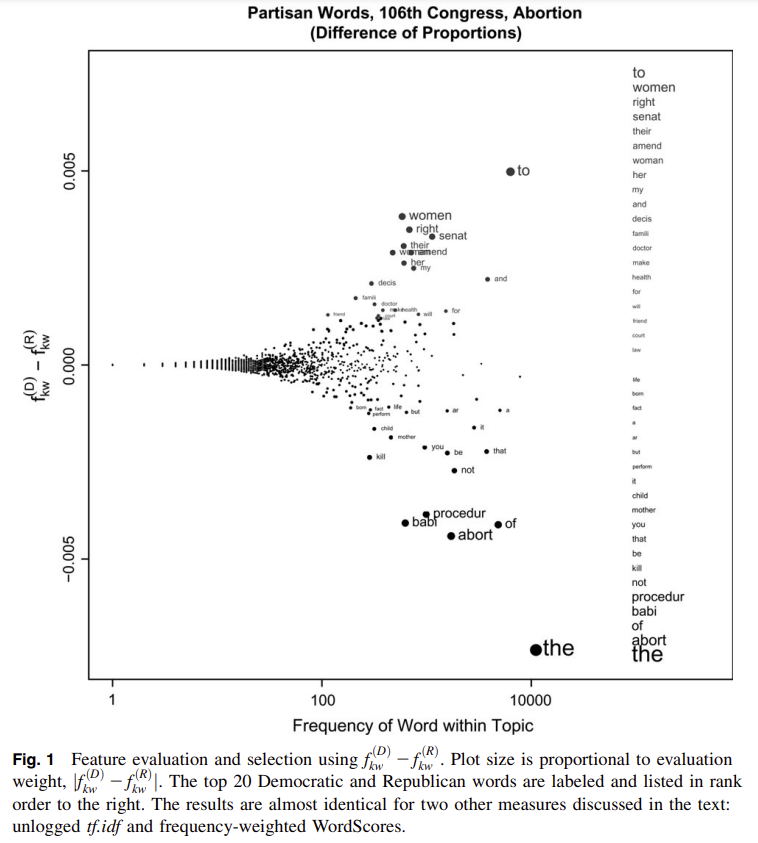
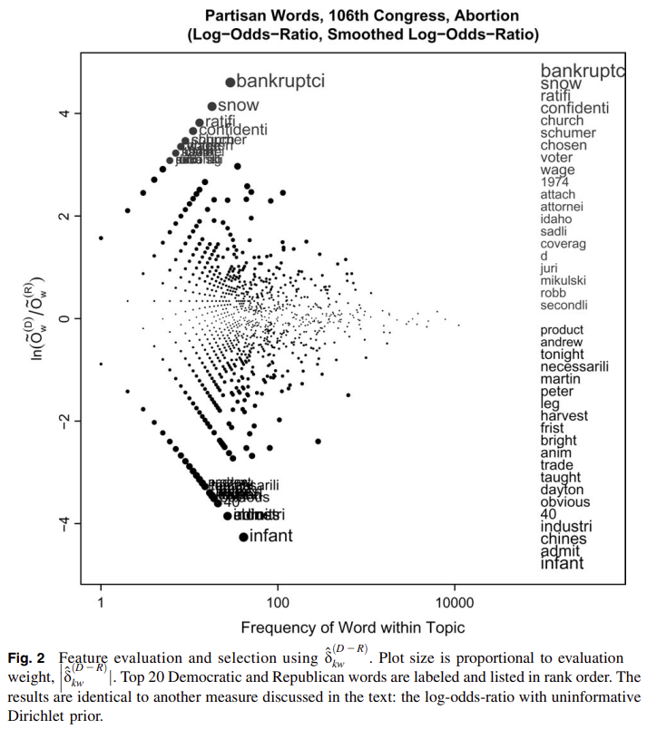
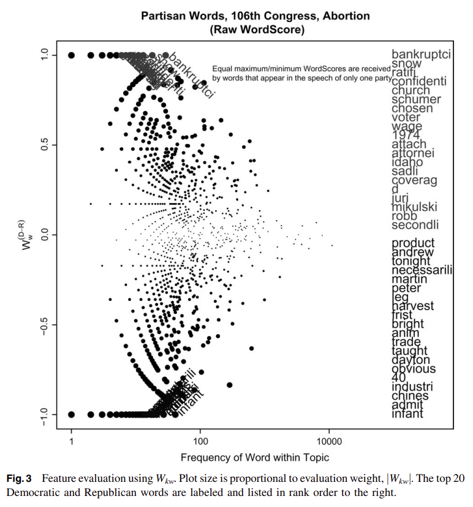
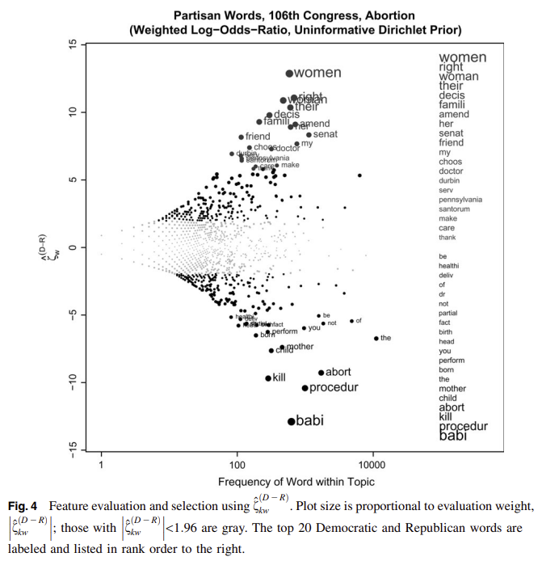
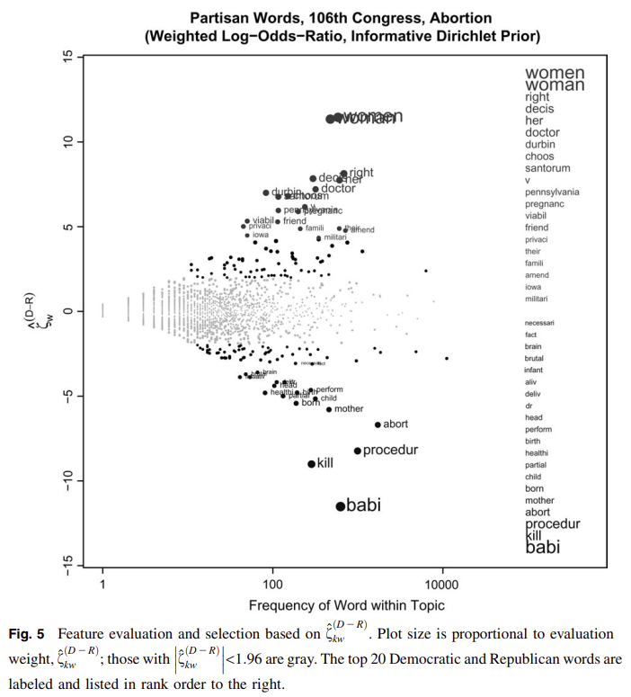
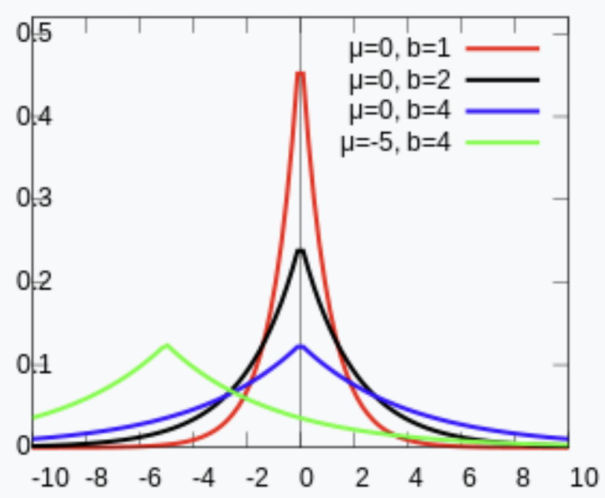
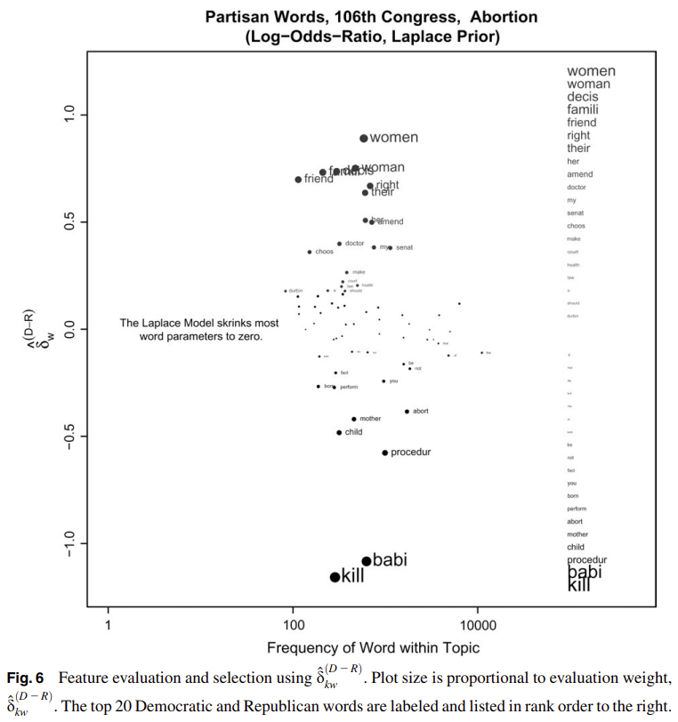

# Fightin' Words: Lexical Feature Selection and Evaluation for Identifying the Content of Political Conflict

[원문 보기](https://www.cambridge.org/core/journals/political-analysis/article/fightin-words-lexical-feature-selection-and-evaluation-for-identifying-the-content-of-political-conflict/81B3703230D21620B81EB6E2266C7A66)

## 1. Introduction

기존에 문서를 집단별로 나누고, **각 집단에 속하는 문서들에서 어떠한 단어들이 특징적으로 나타나는지 관찰**하고 이를 political space에 시각화하는 연구들이 있었으나, 이상한 기준에 따라 나누어지거나 단어가 잘 시각화되지 않는 등의 문제들이 있었다.

## 2. Objectives

### 2.1 Feature selection

한 문서에 있는 단어가 그 문서가 속한 **집단의 특징을 나타내는 단어인지 아닌지**를 구분하는 binary classification이다.

### 2.2 Feature evaluation

한 문서에 있는 단어가 그 문서가 속한 집단에서 얼마나 특징적으로 사용되는지, 즉 **선택된 단어들에 가중치(weight)를 부여하는 것**을 의미한다.

## 3. Methods for Lexical Feature Selection and Evalutaion

### Running example & Notation

미국에서 낙태(abortion)에 대한 민주당원(democratics)과 공화당원(republicans)의 연설 내용을 예시로 사용한다.

> 원 논문에서는 $y^{(i)}\_{kw}$와 같은 횟수에 대해 'frequency'라는 용어를 사용하지만, 횟수가 아닌 비율을 따질 때 $f^{(i)}\_{kw}$와 같은 표현을 사용하면서 'proportion'이라는 단어를 사용하여 혼란이 될 수 있으므로, 각각 '횟수'와 '비율'이라는 단어를 사용하기로 하였다.

- $w =1, 2, ..., W$는 corpus에 속한 단어들을 index로 나타낸 것이다.

- $i \in I$는 각 문서(연설) 혹은 작성자(화자)이 속할 집단을 나타낸 것이다.

- $\mathbf{y}$는 길이 W의 벡터로, corpus에 있는 단어들의 사용 횟수를 나타낸다.

- $\mathbf{y}\_k$는 길이 W의 벡터로, corpus 중 주제 $k$에 대한 문서(연설)에 속한 단어들의 사용 횟수를 나타낸다.

여기서 사용되는 예시에서는 민주당원과 공화당원으로 두 집단이 등장하므로 $I = \{D, R\}$가 되고,

$y^{(D)}\_{kw}$는 민주당원의 주제 $k$에 대한 연설에서 단어 $w$가 사용된 횟수를 나타낸다.

다음 내용부터는, feature selection 또는 feature evaluation을 위해 생각할 수 있는 방법들에 대해 설명한다. 이때, 3.1부터 3.3까지의 내용은 기존의 방법들 및 그 한계점에 대해 설명하고 3.4부터 3.5까지의 내용은 본 논문에서 제안하는 방법이다.

이해를 돕기 위해, 앞으로 설명할 내용에 대해 민주당 및 공화당원의 연설에 대한 예시가 계속 사용될 수 있다.

### 3.1 Classification

연설에 사용된 단어 $w$를 통해 화자 $p$를 찾는 방법으로, 두 가지를 생각할 수 있다.

첫째, 함수 $c : w \to p$로 모델링하는 방법이다. 하지만, 연설이라는 행위 자체는 '화자'가 '단어'를 사용하는 것이지, '단어'가 '화자'를 결정하는 것이 아니므로 원인(화자)을 결과(단어)에 대한 함수로 모델링하는 것 자체가 적절하지 않다.

둘째, 확률 함수 $p(w|p)$를 찾는 추론 문제로 모델링하는 것이다. 여기에도 문제점이 존재하는데, 베이즈 정리인 $p(w|p) \propto p(p|w)p(w)$를 이용하려 하면 모든 가능한 화자의 단어 사용 분포인 $p(w)$를 알아야 한다는 문제가 있으며, 이미 화자가 속한 정당을 알고 있는데도 불구하고 확률 분포 $p(p|w)$처럼 모델링하게 되면 정보를 버리는 것이 되어, 추론 문제로 모델링하기에도 적절하지 않아 보인다.

### 3.2 Nonmodel-Based Approaches

통계 모델이 아닌, 각종 통계량 및 통계량에 기반한 알고리즘을 사용하는 것이다.

#### 3.2.1 Difference of frequencies

$$y^{(D)}\_{kw} - y^{(R)}\_{kw}$$

같은 주제, 같은 단어에 대해 두 집단이 단어를 사용한 횟수의 차이이다. 이 값이 0보다 큰지 작은지를 통해 feature selection & feature evaluation을 할 수 있을 것이다.

당연해 보이는 문제는, 이 값은 연설의 양에 크게 좌우된다는 것이다. 공화당원이 말을 민주당원보다 많은 연설을 했다면, (the, of, and, is, to, a) 같은 단어들은 공화당원이 특징적으로 사용한다는 결론이 나올 것이다.

#### 3.2.2 Difference of proportions

그렇다면 비율로 보면 어떨까?

$$f^{(i)}\_{kw} = y^{(i)}\_{kw} / n^{(i)}\_k$$
$$f^{(D)}\_{kw} - f^{(R)}\_{kw}$$

위 그림의 오른쪽 텍스트는 $|f^{(D)}\_{kw} - f^{(D)}\_{k}|$의 값이 큰 민주당원의 20개 단어와 공화당원의 20개 단어를 나타낸 것으로, 차이가 클수록 글자 크기를 크게 나타낸 것이다.

연설의 양 때문에 발생하는 문제는 줄어들었지만, stop words가 많다.

#### 3.2.3 Correction: removing stop words

Stop word를 제거할 수 있지만, 때에 따라서 stop word를 제거하는 것이 문제가 될 수 있다.

예를 들어 'her'과 같은 단어들은 다른 연설에서는 큰 의미를 갖지 않을 수도 있지만 낙태에 관한 연설에 대해서는 중요한 의미를 가질 수 있으므로, 이러한 단어들은 stop word를 통해 제외하게 되면 중요한 특징을 놓치게 될 수 있다.

또한, stop word를 제거하면 자주 등장하는 non-stop word의 proportion이 더 커지게 되는데 만약 두 연설에 들어 있는 stop word의 비율이 다르다면 같은 단어의 비율 값이 다른 집단에서 다르게 증가할 것이므로 문제가 된다.

#### 3.2.4 Odds

> 본 논문에서 제안하는 최초의 feature evaluation 방법과 관련이 있으니, 앞으로 등장할 odds와 log-odds-ratio가 무엇을 의미하고, 이 방법이 어떤 한계점을 갖는지 파악해 두면 좋다.

Odds는 어떤 사건이 발생할 확률과 발생하지 않을 확률 사이의 비를 의미한다. 예를 들어, 도박 베팅의 승률이 75%라고 한다면 odds는 $0.75 / 0.25 = 3 / 1$, 혹은 $3:1$처럼 표현되는데, 4번의 도박을 했을 경우 3번 이기고 1번 진다는 것을 직관적으로 볼 수 있다는 특징이 있다.

이 논문의 예제에서 odds를 정의하면 아래와 같다.

$$O^{(i)}\_{kw} = f^{(i)}\_{kw} / (1 - f^{(i)}\_{kw})$$

본 논문에서는 odds-ratio에 대한 설명이 3.2.4에 있지만, 내용의 흐름상 3.2.5에 설명하는 것이 적절하다고 생각하여 3.2.5에서 odds ratio 및 log-odds-ratio에 대해 설명한다.

#### 3.2.5 Log-odds-ratio

Odds ratio는 Odds 사이의 비율을 나타내는 것이다.

$$\theta^{(D-R)}\_{kw} = O^{(D)}\_{kw} / O^{(R)}\_{kw}$$

만약 위 odds ratio가 1이라면, 단어 $w$의 사용이 발화자(민주당원/공화당원)와는 독립적이라는 것을 의미한다. 만약 1을 넘는다면, 민주당원일수록 단어 $w$를 사용할 확률이 $\theta^{(D-R)}\_{kw}$배 높다는 뜻이며, 1보다 작다면 반대로 공화당원일수록 해당 단어를 사용할 확률이 높아진다는 뜻으로 해석할 수 있다.

본 논문에서 사용한 데이터로, 'babi'라는 단어를 사용한 odds는 공화당원이 민주당원의 5.4배로 의미 있는 결과라고 볼 수 있지만, 'April'의 경우 공화당원이 민주당원의 7.4배로 나타나서, 의미 있는 결과라고 보기 어렵다.

$$\log\theta^{(D-R)}\_{kw} = \log O^{(D)}\_{kw} - \log O^{(R)}\_{kw}$$

Odds ratio는 수직선상에서 대칭성이 없으므로($\theta^{(D-R)}\_{kw}$와 $\theta^{(R-D)}\_{kw}$는 역수 관계), 로그를 취하면 대칭을 갖는 통계량으로 만들 수 있다.

한편, log-odds-ratio가 $\pm\infty$가 되는 상황이 존재할 수 있는데, 바로 **단어가 한 집단에서만 사용되었을 때**이다. 단어가 하나의 집단에서만 사용되었다면, 반대 집단에서 단어가 사용되는 비율이 0이 되고, odds가 0이 되므로 log-odds가 $-\infty$가 되기 때문이다.

이 문제에 대처하는 방법은 크게 세 가지가 존재하고, 민주당 ↔ 공화당의 예시 단어는 다음과 같다.

##### 1. 그대로 둔다

log-odds-ratio가 $\pm\infty$가 되는 상황을 허용하게 되면, **하나의 당에서만 사용된 단어들이 feature로 선정될 것**이다.

(backruptci, Snow[e], ratifi, confidenti, church) ↔ (infant, admit,
Chines, industri, 40)

##### 2. 하나의 집단에서만 사용된 단어를 제외한다

(treati, discrim, abroad, domest, privacy) ↔ (perfect, subsid, percent, overrid, cell)

##### 3. Compromise: 각 단어의 사용 비율에 작은 상수를 더한다.

$\tilde{f}^{(i)}\_{kw} = f^{(i)}\_{kw} + \epsilon$와 같이 작은 수를 더하는 경우, 다음과 같은 결과를 얻을 수 있다.

하지만, 낙태에 대해 더 중요하다고 생각되는 단어인 'infant'는 'backruptci'보다, 'church'는 'Chines'보다 더 중요하게 해석되는 것을 보아, 납득할 만한 결과를 잘 내지 못하고 있다.

이러한 문제는 sample에 사용된 단어의 수가 적을 때, 흔하지 않은 단어들의 경우 log-odds-ratio가 크게 나타날 수 있어 **크게 중요하지 않은 단어들의 log-odds-ratio가 중요한 단어들보다 크게 나타날 수 있다**.

#### 3.2.6 Correction: eliminating low-frequency words

이를 해결하기 위해 일정 횟수 이상 사용되지 않은 단어들을 제외하는 방법 등을 생각할 수 있지만, 큰 효과가 없는 것으로 나타났다.

Levitt and Dubner (2005; 194–8)에서 '어머니들의 교육 수준이 높은 집단'에서 특징적으로 등장하는 자녀 이름을 찾아보며 '각 이름이 10번 이상 등장할 것'이라는 조건을 추가하였는데, 그럼에도 불구하고 **결과로 나온 자녀 이름이 등장한 횟수는 대부분 최소 횟수인 10번에 가까웠다**.

정치 분야에서 Slapin and Proksch (2008)의 연구 역시 의미 있는 단어들의 목록 대신 중요하지 않아 보이는 단어들이 등장했다고 한다. 단어의 최소 횟수를 정하는 경우 $\tilde{f}^{(i)}\_{kw} = f^{(i)}\_{kw} + \epsilon$에서 $\epsilon$을 결정하는 것으로 생각할 수 있는데, 이 오차항에 대한 분산이 집단마다 달라(heteroskedasticity) 원하는 결과가 나오지 않은 것으로 분석했다.

> 3.2.4부터 3.2.6까지의 내용을 요약하면 결국, log-odds-ratio를 통해 feature evalutaion을 적용하는 경우 log-odds-ratio가 발산하거나, 자주 사용되지 않은 단어들에 대해 log-odds-ratio가 크게 나타나는 등의 이유로 바람직한 결과를 얻기 어렵다는 것이다. 이후 논문에서 제안하는 내용 중 하나는 여기에서 odds를 정의하기 위해 사용되는 '단어 사용 비율'을 통계 모델을 정의한 뒤 '단어 사용 확률'로 대체하고 분포를 구성하는 것이다.

#### 3.2.7 tf.idf (Computer Science)

Term frequency-inverse document frequency를 뜻하는 말로, 문서 내의 한 단어가 얼마나 중요한지를 나타낸 가중치로 볼 수 있다. tf.idf는 TF term($f^{(i)}\_{kw}$)과 IDF term($df\_{kw}$)의 두 가지 항으로 이루어져 있는데, IDF term인 $df\_{kw}$은 주제 $k$에 대하여 단어 $w$를 한 번이라도 사용한 문서의 비율의 역수를 나타낸다. tf.idf의 공식은 IDF term이 로그로 표현되었는지 아닌지에 따라 두 가지가 존재한다.

$$tf.idf^{(i)}\_{kw} = f^{(i)}\_{kw} / df\_{kw}$$
$$tf.idf^{(i)}\_{kw} = f^{(i)}\_{kw} \ln(1/df\_{kw})$$

본 논문의 예제에 적용하면, TF term은 각 정당에서 단어의 사용 비율을 나타내므로 이 값이 높을수록 집단의 특징을 잘 드러낸다고 볼 수 있으며, IDF term은 단어가 사용된 정당의 비율의 역수이므로, 이 값이 높을수록 해당 단어가 사용된 문서의 비율이 낮아져 특정성이 높아지는 것으로 해석할 수 있다.

연설 데이터에 tf.idf 기법을 적용하였을 때의 결과는, 3.2.2에서 구한 비율의 차이를 통해 얻은 결과와 매우 유사하다고 한다.

#### 3.2.8 WordScroes (Political Science)

3.2.2의 비율 차이에 scaling을 적용한 것이다. 만약 민주당을 +1, 공화당을 -1로 놓고 기본적인 WordScore를 적용하는 식은 다음과 같다.

$$W^{(D-R)}\_{kw} = \frac{f^{(D)}\_{kw} - f^{(R)}\_{kw}}{f^{(D)}\_{kw} + f^{(R)}\_{kw}}$$

또한, 하나의 정당에서만 나타난 단어들에 대해서는 +1과 -1의 값을 부여할 수 있다. 이를 나타낸 결과는 아래와 같은데, 민주당과 공화당 두 집단이 있으므로 단순 비율 차이로 구한 것과 큰 차이를 보이지 않는다.

여기에 주제 $k$의 연설에서 단어 $w$가 사용된 횟수인 $n\_{kw}$를 곱하면, 많이 사용되면서도 정당의 특징을 나타내는 단어들을 시각화할 수 있지만, 자주 사용되는 단어들이 지나치게 큰 가중치를 갖는 현상이 발생한다.

$$W^{*(D-R)}\_{kw} = \frac{f^{(D)}\_{kw} - f^{(R)}\_{kw}}{f^{(D)}\_{kw} + f^{(R)}\_{kw}} n\_{kw}$$

### 3.3 Model-Based Approaches

여기에서는, 단어의 선택이 정당에 의해 결정된다고 보고 $P(w|p)$를 모델링한다. 먼저 전체 문서들의 모음에 대한 모델에 대하여 논의하고, 이에 기초하여 각각의 집단에 대한 모델을 다시 만들어 전체 문서에 대한 모델과 어떻게 다른지 살펴볼 것이다.

#### 3.3.1 The likelihood

$n$개의 단어(중복 포함)가 있는 전체 corpus에서 각각의 단어가 사용된 횟수를 나타내는 벡터를 $\mathbf{y}$라고 하고, 다항분포(multinomial distribution)로 모델링할 수 있다.

$$\mathbf{y}\sim{\text{Multinomial}(n, \boldsymbol\pi)}$$

다항분포는 이항분포가 확장된 것으로, 위 식의 의미는 1번의 시행에서 단어 $w$는 $\pi\_w$의 확률로 나타나며, 이 시행을 독립적으로 $n$번 반복하는 것이다.

위의 분포에서는, $n=\sum\_{w=1}^{W}y\_w$이고 $\boldsymbol\pi$는 각 단어 $w$가 등장할 확률을 나타내는 길이 $W$의 확률 벡터이다. 확률 벡터에서 각 확률의 합은 1이므로, 이 벡터는 자유도 $(W-1)$을 갖는다.

자유도가 $(W-1)$인데 길이 $W$의 벡터가 사용되었으므로, 벡터 $\boldsymbol\pi$의 각 항에 대해 $\pi\_1$에 대한 log-odds를 계산하여 다음의 벡터 $\boldsymbol\beta$를 정의하여 사용하자.

$$\beta\_w = log(\pi\_w) - log(\pi\_1)$$

$\boldsymbol\beta$로부터 $\boldsymbol\pi$를 얻고자 한다면, softmax 함수를 이용할 수 있다.

$$\pi\_w = \frac{\text{exp}(\beta\_w)}{\sum\limits_{j=1}^{W}\text{exp}(\beta\_j)}$$

만약 우리가 다항분포의 모수인 $\boldsymbol\pi$ 또는 $\boldsymbol\beta$를 알고 있다면, likelihood $L(\mathbf{y}|\boldsymbol\beta)$와 log-likelihood $\ell(\mathbf{y}|\boldsymbol\beta)$는 다음과 같이 구할 수 있다.

$$
L(\mathbf{y}|\boldsymbol\beta) \propto \prod\_{w=1}^W{\pi\_w}^{y\_w} = \prod\_{w=1}^W(\frac{\text{exp}(\beta\_w)}{\sum\limits_{j=1}^W\text{exp}(\beta\_j)})^{y\_w}
$$

$$
\ell(\mathbf{y}|\boldsymbol\beta)=\sum\_{w=1}^W y\_w \log \left(\frac{\exp \left(\boldsymbol{\beta}\_w\right)}{\sum\limits_{j=1}^W \exp \left(\boldsymbol{\beta}\_j\right)}\right) + \text{const}
$$

> 본 논문에서는 likelihood 및 log-likelihood가 각각 $L(\boldsymbol\beta|\mathbf{y})$와 $\ell(\boldsymbol\beta|\mathbf{y})$로 표기되어 $\mathbf{y}$와 $\boldsymbol\beta$의 순서가 반대인데, likelihood의 의미를 생각하였을 때 바꾸어 표기하는 것이 적절하다고 생각하여 여기서는 바꾸어 사용하였다.

> 또한 실제로 각 단어가 관측된 횟수 벡터인 $\mathbf{y}$의 likelihood를 구할 때는 각각의 단어가 관측될 수 있는 순서까지 고려하여, 단어 1 $y\_1$개, 단어 2 $y\_2$개, ... , 단어 $W$ $y\_W$개를 배열하는 permutation의 수인 $\frac{n !}{y\_{1} ! y\_{2} ! \ldots y\_{W} !}$를 곱해 주어야 하지만, MLE를 구하거나 베이즈 정리에 활용할 때는 $\mathbf{y}$가 주어져 있다고 가정하기 때문에 이 값이 상수가 되어 고려하지 않으므로 여기서는 $\propto$ 기호와 $\text{const}$ 등의 표현을 사용하여 생략하였다.

한편 여기에서, likelihood를 최대로 만드는 모수 $\hat{\boldsymbol\pi}^{\text{MLE}}$는 다음과 같이 추정할 수 있어 직관과 일치한다.

$$\hat{\boldsymbol\pi}^{\text{MLE}}=\mathbf{y}\cdot{1/n}$$

$\boldsymbol\pi$로부터 $\boldsymbol\beta$를 정의한 방법과 마찬가지로 첫 번째 확률에 대해 log-odds를 계산함으로써 $\hat{\boldsymbol\pi}^{\text{MLE}}$로부터 $\hat{\boldsymbol\beta}^{\text{MLE}}$를 구할 수 있다.

한편, 같은 방법으로 주제 $k$에 대한 단어 사용 빈도의 분포를 다음과 같이 모델링할 수 있다.

$$\mathbf{y\_k}\sim{\text{Multinomial}(n\_k, \boldsymbol\pi\_k)}$$

또한, 주제 $k$에 대한 집단별 단어 사용 빈도의 분포를 다음과 같이 모델링할 수 있다.

$$\mathbf{y^{(i)}\_k}\sim{\text{Multinomial}(n^{(i)}\_k, \boldsymbol\pi^{(i)}\_k)}$$

Likelihood와 log-likelihood, MLE를 구하는 방법 역시 같다.

#### 3.3.2 Prior

베이지안 모델을 적용하기 위해 다항분포에 적용할 수 있는 conjugate prior는 디리클레 분포(Dirichlet distribution)이며, 다음과 같다.

$$\boldsymbol\pi \sim \text{Dirichlet}(\boldsymbol{\alpha})$$

이때 $\boldsymbol\alpha$는 길이 $W$의 벡터이며, $\alpha\_w>0$을 만족하고, prior sample size로 해석된다.

**예를 들어, $\alpha\_w$가 자연수라면 관측 전에 이 prior를 적용하는 것은, 단어 $w$를 이미 $(\alpha\_w - 1)$회 관찰했다는 뜻으로 해석할 수 있다.** 만약 $\alpha\_w \leq 1$이면, 사전에 관찰한 횟수가 0이 된다고 생각할 수도 있는데 이렇듯 prior의 비중을 매우 낮게 설정한 것을 uninformative prior라고 한다.

여기서부터 3.4의 내용까지는 모든 $w$에 대하여 $\alpha\_w = 0.01$로 설정한 uninformative prior를 사용하였다.

#### 3.3.3 Estimation

디리클레 분포는 다항분포의 conjugate prior로 사용될 수 있으므로, likelihood에 prior를 적용한 결과인 posterior 분포 역시 다항분포가 되며 posterior distribution를 최대로 만드는 모수 $\hat{\boldsymbol\pi}$는 다음과 같다. 집단에 대해 위 첨자를 사용해야 하기도 하고, 앞으로 제안할 방법에서 이를 사용할 것이기 때문에 별도로 MAP 표기를 하지 않을 것이다.

$$\hat{\boldsymbol\pi}=(\mathbf{y + \boldsymbol\alpha}) \cdot 1 / (n + \alpha\_0), \text{where } \alpha\_0 = \sum\_{w=1}^W \alpha\_w$$

한편, 3.3.1에서 각각의 분포 및 likelihood, log-likelihood, MLE를 주제와 집단별로 나누어 생각한 것처럼, 같은 논리를 여기에서도 적용할 수 있다.

#### 3.3.4 Feature evaluation

> 본 논문에서 제안하는 첫 번째 feature evaluation 방법으로, 3.2.4부터 3.2.6까지의 odds 관련 방법에 확률 분포를 적용시킨 것이다.

이제 다항분포의 모수 $\boldsymbol\pi$의 단어별 확률 $\pi\_w$에 대하여 각각을 odds로 변환하여, $\Omega\_w = \pi\_w / (1-\pi\_w)$라고 하자. 여기서도, 주제와 집단에 따라 $\Omega\_{kw}^{(i)}$와 같이 쓸 수도 있다. **하지만, 3.2.4부터 3.2.6까지의 odds 관련 방법과 다른 것은 기존의 방법에서 사용한 $f\_{kw}^{(i)}$는 '단어의 사용 비율'이라는 주어진 데이터에서 그대로 추출한 통계량이고, 여기서 사용한 $\Omega\_{kw}^{(i)}$는 3.3.1부터 3.3.3까지의 내용을 통해 살펴본 확률 모델의 확률 값에 해당한다.**

여기에 log-odds-ratio을 적용하여 각 집단에서 단어에 대한 feature evaluation을 수행할 수 있다. 먼저 단어 $w$의 주제, 집단별 사용 비율의 MAP 추정치 및 odds는 다음과 같다.

$$\hat\pi\_{wk}^{(i)} = \frac{y\_{kw}^{(i)} + \alpha\_{kw}^{(i)}}{n\_{k}^{(i)}+\alpha\_{k0}^{(i)}}$$

$$
\hat\Omega\_{kw}^{(i)} = \hat\pi\_{wk}^{(i)} / (1-\hat\pi\_{wk}^{(i)})
 = \frac{y\_{kw}^{(i)} + \alpha\_{kw}^{(i)}}{n\_{k}^{(i)}+\alpha\_{k0}^{(i)}-y\_{kw}^{(i)}-\alpha\_{kw}^{(i)}}
$$

$$
\hat\delta\_{kw}^{(i)}  = \log{\hat\Omega\_{kw}^{(i)}} - \log{\hat\Omega\_{kw}} =
\log\left[\frac{y\_{kw}^{(i)} + \alpha\_{kw}^{(i)}}{n\_{k}^{(i)}+\alpha\_{k0}^{(i)}-y\_{kw}^{(i)}-\alpha\_{kw}^{(i)}}\right] - \log\left[\frac{y\_{kw} + \alpha\_{kw}}{n\_{k}+\alpha\_{k0}-y\_{kw}-\alpha\_{kw}}\right]
$$

두 집단에 대하여 차이를 보고자 한다면, log-odds-ratio의 차를 구하면 된다.

$$
\hat\delta\_{kw}^{(i-j)}  = \log{\hat\Omega\_{kw}^{(i)}} - \log{\hat\Omega\_{kw}^{(j)}} =
\log\left[\frac{y\_{kw}^{(i)} + \alpha\_{kw}^{(i)}}{n\_{k}^{(i)}+\alpha\_{k0}^{(i)}-y\_{kw}^{(i)}-\alpha\_{kw}^{(i)}}\right] - \log\left[\frac{y\_{kw}^{(j)} + \alpha\_{kw}^{(j)}}{n\_{k}^{(j)}+\alpha\_{k0}^{(j)}-y\_{kw}^{(j)}-\alpha\_{kw}^{(j)}}\right]
$$

만약 prior가 없다면, 이 값은 3.2.5에서 구한 log-odds-ratio와 일치할 것이다. 또한, 균일한 prior, 즉 $\alpha\_w$의 값이 모두 같은 prior를 사용한다면 결국 3.2.5와 3.2.6에서 보았던 것과 같이, log-odds-ratio을 사용하고 smoothing을 적용하더라도 좋은 결과를 얻지 못할 수 있다.

하지만, 확률 모델을 이용함으로써 우리는 두 가지 이점을 얻을 수 있다.

- 첫째, odds에 대하여 개별적인 단어에 따라 다른 합리적인 smoothing을 정하고 조정할 수 있다.

- 둘째, 확률 모델을 가정하였기 때문에 posterior 분포를 알고 있으므로, **단순한 추정치를 구하는 것뿐만 아니라 분산을 구하여 z-score를 구하고 신뢰구간을 찾아 유의미한 차이가 있는지를 결정할 수 있는 등 더 의미 있는 정보를 얻을 수 있다.**

> 3.2.4에서 얻은 odds와 여기에서 얻은 odds 공식을 비교해 보자.
> $$O^{(i)}\_{kw} = f^{(i)}\_{kw} / (1 - f^{(i)}\_{kw}) = \frac{y\_{kw}^{(i)} }{n\_{k}^{(i)}-y\_{kw}^{(i)}}$$
>
> $$
> \hat\Omega\_{kw}^{(i)} = \hat\pi\_{wk}^{(i)} / (1-\hat\pi\_{wk}^{(i)})
>  = \frac{y\_{kw}^{(i)} + \alpha\_{kw}^{(i)}}{n\_{k}^{(i)}+\alpha\_{k0}^{(i)}-y\_{kw}^{(i)}-\alpha\_{kw}^{(i)}}
> $$
>
> 확률 모델을 이용하고 베이즈 정리를 사용하면, 우리는 디리클레 분포의 모수를 조정함으로써 odds의 추정치를 변화시킬 수 있으므로, 단어별로 smoothing term을 넣을 합리적인 근거를 마련했다고 볼 수 있을 것이다.

그렇다면, $\hat\delta\_{kw}^{(i)}$을 구하여 의미 있는 정보를 찾기 위해 사용할 수 있을 것이다. 본 논문에서는 $\hat\delta\_{kw}^{(i)}$를 구할 때 사용하는 $\log{\hat\Omega\_{kw}^{(i)}}$, $\log{\hat\Omega\_{kw}}$, $\log{\hat\Omega\_{kw}^{(j)}}$를 구할 때 발생할 수 있는 공분산을 무시하였다.

집단에 대한 첨자를 생략하면 $\log{\hat\Omega\_{kw}}$의 분산을 구하면 되는데, 확률변수 $\pi\_{wk}$의 posterior 분포를 알고 있으므로, $\log{\hat\Omega\_{kw}^{(i)}}$를 $\pi\_{wk}$에 대하여 테일러 전개한 뒤 앞의 항을 사용하는 방식으로 분산을 구한 것으로 보인다.

본 논문에서 제안한 $\hat\delta\_{kw}^{(i)}$의 분산의 값은 다음과 같다.

$$
\begin{split}
\sigma^2\left(\hat{\delta}\_{k w}^{(i)}\right)&\approx \frac{1}{\left(y\_{k w}^{(i)}+\alpha\_{k w}^{(i)}\right)}+\frac{1}{\left(n\_k^{(i)}+\alpha\_{k 0}^{(i)}-y\_{k w}^{(i)}-\alpha\_{k w}^{(i)}\right)}+\frac{1}{\left(y\_{k w}+\alpha\_{k w}\right)}+\frac{1}{\left(n\_k+\alpha\_{k 0}-y\_{k w}-\alpha\_{k w}\right)}\\
&\approx \frac{1}{\left(y\_{k w}^{(i)}+\alpha\_{k w}^{(i)}\right)}+\frac{1}{\left(y\_{k w}+\alpha\_{k w}\right)}
\end{split}
$$

$$
\begin{split}
\sigma^2\left(\hat{\delta}\_{k w}^{(i-j)}\right) &\approx \frac{1}{\left(y\_{k w}^{(i)}+\alpha\_{k w}^{(i)}\right)}+\frac{1}{\left(n\_k^{(i)}+\alpha\_{k 0}^{(i)}-y\_{k w}^{(i)}-\alpha\_{k w}^{(i)}\right)}+\frac{1}{\left(y\_{k w}^{(j)}+\alpha\_{k w}^{(j)}\right)}+\frac{1}{\left(n\_k^{(j)}+\alpha\_{k 0}^{(j)}-y\_{k w}^{(j)}-\alpha\_{k w}^{(j)}\right)}\\
&\approx \frac{1}{\left(y\_{k w}^{(i)}+\alpha\_{k w}^{(i)}\right)}+\frac{1}{\left(y\_{k w}^{(j)}+\alpha\_{k w}^{(j)}\right)}
\end{split}
$$

위 식에는 각각 두 번의 근사가 사용되었는데, 두 식의 첫 번째 근사는 $y\_{k w}^{(i)} \gg \alpha\_{k w}^{(i)}$, $y\_{k w} \gg \alpha\_{k w}$와 함께 공분산을 무시한 것이고, 두 번째 근사는 $n\_k^{(i)} \gg y\_{kw}^{(i)}$와 $n\_k \gg y\_{kw}$를 가정한 것이다.

즉, prior에서 설정한 단어의 횟수보다 실제 corpse에 있는 단어를 더 많이 보겠다는 의미이며, 하나의 단어가 전체 corpse에서 차지하는 비율이 매우 작다는 합리적인 가정을 하였다.

### 3.4 Accounting for Variance

이제, 위에서 구한 추정치의 분산을 이용하여 z-score를 다음과 같이 정의하자.

$$\hat\zeta\_{kw}^{(i)} = \hat{\delta}\_{k w}^{(i)} / \sqrt{\sigma^2\left(\hat{\delta}\_{k w}^{(i)}\right)}$$

$$\hat\zeta\_{kw}^{(i-j)} = \hat{\delta\}\_{k w}^{(i-j)} / \sqrt{\sigma^2\left(\hat{\delta}\_{k w}^{(i-j)}\right)}$$

정당 예제에서, 모든 $w$에 대해 $\alpha\_w=0.01$로 설정한 uniformative Dirichlet prior를 사용하여 $\hat\zeta\_{kw}^{(D-R)}$을 시각화한 결과는 아래와 같으며, 확률 분포를 통해 구한 값이기 때문에 z-score를 1.96으로 설정함으로써, **z-score가 1.96이 넘어가는 경우 두 집단 간 단어 사용에 유의미한 차이가 있는 것으로 보았다.**

앞에서 확률 모델 없이 log-odds-ratio를 적용한 것과 다르게, 이번에는 낙태에 관하여 매우 특징적인 단어들이 분포의 양끝에 더 잘 드러났다고 볼 수 있다.

민주당원의 경우에는 주로 여성의 권리에 대한 단어들(women/right)이 특징적으로 드러났으며, 공화당원의 경우에는 아기를 살해하는 행위에 대한 단어들(baby/procedur/kill)이 특징적으로 드러났다. 이는 공화당에서 주로 주장하는 \_partial birth abortion procedure\_('낙태'와 '영아의 의도적 살해'의 경계에 관한 논의)에 대한 내용이 잘 나타나고 있음을 한눈에 볼 수 있다.

하지만, 여전히 그림에서는 the, of, be, not, my 등의 단어들이 나타나고 있는데, 이는 모든 단어들이 prior에서 0이 아닌 weight를 부여받기 때문에 일종의 overfitting이 발생하였다고 볼 수 있다.

이 방법은 특정 단어의 주제별, 집단별 posterior 분포에 대하여 평균에 대한 유의미한 차이가 있는지 $\chi^2$ test를 통해 검증하는 것과 비슷한 아이디어라고 볼 수 있다. 다만, 기존의 $\chi^2$ test를 통한 방법은 $\chi^2$ 값 자체가 feature evaluation 기능을 할 수 없는 데 반해 본 논문에서 제안한 방법은 z-score를 통해 feature evaluation이 가능하도록 하였다는 점에서 의의를 갖는다.

> 요약하면, uninformative Dirichlet prior를 가정하고 log-odds-ratio의 posterior 분포의 MAP과 분산을 이용하여 특정 주제와 집단에서 단어의 z-score를 계산함으로써, 통계적으로 유의미한 차이가 있는 것으로 보이는 합리적인 기준 및 feature evaluation의 수단을 마련하였고, 집단 간 사용하는 단어에 대하여 더 납득할 만한 결과를 얻었다. 다만, 아직 일부 자주 사용되는 단어들에 의해 유의미한 차이가 있다는 잘못된 결과가 도출되는 overfitting 문제가 존재한다.

### 3.5 Shrinkage and Regularization

> 본 논문에서 제안하는 두 번째 feature evaluation 방법으로, uninformative Dirichlet 분포를 사용했을 때 모든 집단에서 자주 사용되는 단어(functional word 등)들이 특징으로 나타나는 overfitting 문제를 해결하기 위한 첫 번째 방법이다.

머신러닝에서 overfitting을 막기 위해 regularization이 이용되는 것처럼, 통계 모델에서는 위와 같은 문제를 해결하는 방법으로 베이지안 shrinkage를 사용한다. 이를 위한 여러 방법이 존재하지만, 여기에서는 크게 두 가지 방법을 알아볼 것이다.

- 첫째, 앞서 정의하였던 Dirichlet 분포의 prior를 조정하는 것이다. 만약 앞선 모델에서 $\alpha\_w$의 값을 조정함으로써, 집단 간 사용되는 단어들에 대하여 유의미한 차이가 없을 것이라는 prior를 적용할 수 있을 것이다.

- 둘째, 다른 형태의 prior인 Laplace functional form을 사용할 것이다.

#### 3.5.1 Informative Dirichlet prior

> 이 방법은 Marked Personas (Myra Cheng et al., 2022) 논문에서 marked word를 찾기 위해 사용한 방법이다.

Uninformative Dirichlet prior에서 $\alpha\_w$의 값을 매우 작게 설정한 것과 다르게, 여기에서는 prior sample을 추출했다고 가정한 뒤 $\alpha\_{kw}^{(i)}$의 값을 다음과 같이 설정하기로 한다.

$$\alpha\_{kw}^{(i)} = \alpha\_{k0}^{(i)}\hat{\boldsymbol\pi}^{\text{MLE}} = \mathbf{y} \cdot \frac{\alpha\_0}{n}$$

이 식에서 주목해야 할 검은, 주제별, 집단별 단어 사용에 대한 prior의 모수인 $\alpha\_{kw}^{(i)}$를 설정하는 데 있어 주제와 집단에 관련이 없는 $\mathbf{y}$, $\alpha\_0$, $n$을 사용하였으므로, 주제별, 집단별 단어 사용 확률을 global 쪽으로, 또 집단 간의 log-odds-ratio를 0 쪽으로 'shrink'하였다고 볼 수 있다.

> 이러한 informative Dirichlet prior 설정은 크게 두 가지의 의의를 가질 수 있다.
>
> - 첫째, 즉 이렇게 설정한 prior는 '단어 사용의 비율이 주제 및 집단과 관련이 없다'는 믿음을 표현할 수 있다.
> - 둘째, uninformative Dirichlet prior와는 달리 전체적인 단어 사용 비율을 반영할 수 있게 된다.

본 논문에서 사용한 $\alpha\_0$의 값은 500으로, 이는 데이터셋에서 하나의 정당에서 하루 동안 진행한 연설의 평균적인 단어 수에 해당한다. **이렇게 global prior를 설정하게 되면, uninformative Dirichlet prior에서 functional words가 feature로 선택되는 문제점을 어느 정도 해결할 수 있게 된다.** 이를 적용한 결과는 아래 그림과 같다.

> the, of, be, not, my와 같은 단어들은 데이터셋에서만 봤을 때 유의미한 빈도 차이가 있지만 사실 모든 집단에서 자주 사용하는 단어이므로, Dirichlet prior에서 높은 가중치를 부여함으로써 두 집단 간 단어 사용 빈도 차이가 없다는 prior를 더 강하게 설정하므로 feature로 선택될 가능성이 더 낮아지게 되며, 그 밖의 단어들은 전체적으로 잘 사용되지 않으므로 prior에서 큰 가중치를 갖지 않지만 특정 집단에서만 사용되었을 때 posterior에 더 큰 영향을 미치기 때문에 feature로 잘 선택된다는 것으로 해석할 수 있다.

'단어 사용의 비율이 주제 및 집단과 관련이 없다'는 prior는 선택하는 feature의 수를 감소시키는 효과가 있으며 모든 집단에서 자주 사용되는 단어를 없앰으로써 더 의미 있는 feature만 남길 수 있을 뿐만 아니라, $\alpha\_0$의 값을 조정하여 상대적인 prior의 세기 역시 조절할 수 있다.

이 방법은 다음과 같은 장점을 가진다.

- 첫째, prior와 posterior가 알려진 분포를 따르기 때문에, MAP을 쉽게 구할 수 있으므로 방대한 계산이 필요하지 않다.

- 둘째, 간단한 방법으로, 이후에 소개될 방법과 같이 변형하거나 확장하기 쉽다.

- 셋째, 집단을 정의하는 방법이 달라지더라도 같은 방법을 사용할 수 있기 때문에 적용 범위가 넓다.

또한, 이 방법은 다음과 같은 한계점을 가진다.

- 아직도 feature selection에 대한 문제가 남아 있어서, 정량적으로 집단의 특징을 나타내는 데 중요한 단어의 기준을 세우기가 애매하며, overfitting의 가능성이 있다.

#### 3.5.2 Laplace prior

Laplace prior는 prior로써 Dirichlet 분포 대신 Laplace 분포를 사용하는 것으로, **집단 간의 log-odds-ratio을 '0에 가깝게'가 아닌 '0으로 shrink'시키려 한다는 특징**이 있으며, 머신러닝 분야에서 L1 정규화와 비슷한 기능을 하여 feature selection의 향상을 목적으로 한다. Laplace prior의 확률밀도함수는 다음과 같다.

$$
x \sim \text{Laplace}(\mu, \frac{1}{b})
$$
$$
f(x\mid \mu ,b)={\frac {1}{2b}}\exp \left(-{\frac {|x-\mu |}{b}}\right)
$$

Laplace 분포는 두 exponential 분포를 $x=\mu$를 기준으로 이어 붙인 것인데, 여기에서 $b$는 분산을 결정하는 매개 변수로 scale parameter라고 부르며, $b$의 값이 커질수록 확률밀도함수의 최댓값이 더 작아지고 분산이 커지게 된다.

아래는 여러 가지 $\mu$와 $b$의 값에 대응되는 확률밀도함수의 그래프이다.

> [Laplace prior는 왜 L1 정규화에 해당할까?](https://thegreatkwanghyeon.tistory.com/2) Posterior의 log-likelihood를 구하는 과정을 보면 그 이유를 알 수 있다.
> $$\hat{\theta}^{\text{MAP}} = \arg\min_\theta [- \log P(y|\theta) - \log\prod_{i=1}^{d}\frac{1}{2b}\exp(-\frac{|\theta_i|}{b})]$$
> $$= \arg\min_\theta [- \log P(y|\theta) - \sum_{i=1}^{d}\log\frac{1}{2b}+\sum_{i=1}^{d}\frac{|\theta_i|}{b}]$$
> $$= \arg\min_\theta [- \log P(y|\theta) + \frac{1}{b}\sum_{i=1}^{d}|\theta_i|]$$
> $$= \arg\min_\theta [- \log P(y|\theta) + \lambda\sum_{i=1}^{d}|\theta_i|]$$
> 따라서, 3.5.1의 informative Dirichlet prior를 사용하였을 때 생겼던 feature selection의 문제점을 해결하기 위하여, L1 정규화를 적용하는 것과 같이 Laplace prior를 설정함으로써 작은 차이를 완전히 0으로 만들어 주는 것이 가능하다.
> 반대로, Gaussian prior를 사용하는 것은 $\text{exp}$ 안에 이차식이 들어가 있으므로, prior로 사용할 때에는 L2 정규화에 해당하는 것으로 생각할 수도 있다.

본 논문에서 소개하는 방법을 알아보기 위해, 3.3.1에서 정의한 $\boldsymbol\beta$를 다시 떠올려 보자.

$$\beta\_w = log(\pi\_w) - log(\pi\_1)$$

Laplace prior를 사용하여 $\boldsymbol\beta\_k^{(i)}$의 prior를 다음과 같이 설정할 수 있다. 3.5.1에서 prior의 모수를 설정할 때, 주제 및 집단에 의한 차이가 없다는 믿음을 반영하기 위하여 전체 데이터의 표본을 사용한 것처럼, 여기에서도 각각의 집단별로 사용하는 단어들의 log-odds-ratio의 모수를 설정할 때 집단에 따라 구분하지 않았으므로 **'집단에 의한 단어 사용 빈도의 차이가 없다'는 믿음을 반영**하였다고 생각할 수 있다.

$$
\beta\_{kw}^{(i)} \sim \text{Laplace}(\hat{\beta}\_{kw}^{\text{MLE}}, \gamma)
$$

이를 확률밀도함수로 나타내면 다음과 같다. $\beta\_w$의 정의에 따라, $w=1$일 때의 $\beta\_1$ 값은 항상 0이 될 것이므로, Laplace prior의 값도 1이 될 것이다. 나머지 원소에 대해 Laplace prior의 확률밀도함수를 곱한다면, $\gamma$가 주어졌을 때의 Laplace prior는 다음과 같다.

$$
p(\boldsymbol\beta\_k^{(i)}|\gamma) = \prod\_{w=2}^W \frac{\gamma}{2} \exp \left(-\gamma|\beta\_{kw}^{(i)}-\hat{\beta}\_{kw}^{\text{MLE}}|\right)
$$

즉 $\mu = \hat{\beta}\_{kw}^{\text{MLE}}$이고, $b = \frac{1}{\gamma}$가 되어, $\gamma$를 inverse scale parameter라고 한다. 즉, $\gamma$가 작아질수록 Laplace prior의 분포는 옆으로 더 넓게 퍼지는 모양이 될 것이다.

Prior를 설정할 때 $\gamma$라는 모수를 사용하였으나 모수의 분포를 결정하지 못하였으므로, $\gamma$에 대한 prior를 생각할 수 있고 이를 hyper-prior라고 하자. Hyper-prior를 $P\_E(\gamma)$라 하면, posterior 분포는 다음과 같이 결정될 것이다.

$$
p(\boldsymbol \beta\_k^{(i)}, \gamma \mid y\_k^{(i)}) \propto p(\mathbf y\_k^{(i)} \mid \boldsymbol \beta\_k^{(i)}) \cdot p(\boldsymbol \beta\_k^{(i)} \mid \gamma) \cdot P\_E(\gamma)
$$

이때, 3.3.1에서 $\boldsymbol\beta$가 주어졌을 때 likelihood를 다음과 같이 구하였으므로,

$$
p(\mathbf{y}|\boldsymbol\beta) \propto \prod\_{w=1}^W{\pi\_w}^{y\_w} = \prod\_{w=1}^W(\frac{\text{exp}(\beta\_w)}{\sum\limits_{j=1}^W\text{exp}(\beta\_j)})^{y\_w}
$$

전체 식에 대입한 결과는 아래와 같다.

마지막으로, 논문에서 제안한 hyper-prior는 지수분포와 improper Jeffreys prior로 두 가지가 있어, 위 식의 $P\_E(\gamma)$ 자리에 대입하여 사용할 수 있다.

$$
\begin{align*}
&p(\boldsymbol \beta\_k^{(i)}, \gamma \mid y\_k^{(i)}) \propto p(\mathbf y\_k^{(i)} \mid \boldsymbol \beta\_k^{(i)}) \cdot p(\boldsymbol \beta\_k^{(i)} \mid \gamma) \cdot P\_J(\gamma) \\
&\propto \left\\{ \prod\_{w=1}^W\left( \frac{\exp(\beta\_{kw}^{(i)})}{\sum\limits_{i=1}^W \exp(\beta\_{ki}^{(i)})}\right)^{y\_{kw}}\right\\} \cdot \prod\_{w=2}^W \frac{\gamma}2 \exp\left( - \gamma \left\vert \beta\_{kw}^{(i)} - \hat{\beta}\_{kw}^{MLE} \right | \right) \cdot P\_E(\gamma)
\end{align*}
$$

- 지수분포 : $p\_E(\gamma)=a\exp(-a\gamma)$
- Improper Jeffreys prior : $p\_J(\gamma)\propto 1 / \gamma$

본 논문에서 $a=100$인 지수분포를 이용하여 도출한 결과는 아래와 같으며, 지수분포의 기댓값은 $1/a$이므로, $a$의 값이 더 커지면 $\gamma$의 기댓값이  
줄어들게 되고, 이는 Laplace prior가 더 넓어지는 것을 의미하므로 조금 더 많은 feature를 선택할 수 있게 된다.

이때, 이미 feature selection이 완료되었기 때문에 z-score를 환산할 필요 없이 $\delta\_{kw}^{(D-R)}$의 값을 그대로 feature evaluation의 결과로 나타낼 수 있다.

이번 결과에서는, 선택된 단어들의 수가 이전 결과들에 비해 많이 줄어든 것을 볼 수 있으며, 선택된 단어들을 보면 자주 등장하는 functional word가 많지 않고 대부분 각 집단에서 특징적으로 사용할 만한 단어들이 선택되었다고 볼 수 있다.

3.5.1의 결과에서는, z-score가 낮아 선택되지는 않았지만 불필요하게 많은 단어들이 결과로 등장하였다. 예를 들어, functional word는 feature로 선택되지 않았지만 여전히 z-score를 가지고 있어 특정 집단에서 더 자주 사용될 것이라는 비합리적인 생각을 제공할 여지가 있으나 Laplace prior를 사용하면 이러한 특성들이 무시되는 것이다.

이렇듯, Laplace prior를 사용하면 유의미한 차이가 없다고 여겨지는 feature를 완전히 제거하는 L1 정규화의 효과를 달성할 수 있게 되지만, **세 개의 확률 분포를 곱해야 하고, conjugacy가 없기 때문에 추정에 있어 엄청난 양의 계산을 요구하고, 모델을 다양한 상황에 적용하거나 확장하는 것도 어렵다**는 한계가 있지만, 확률 모델을 통해 feature selection을 구현했다는 점에서 의의가 있다. 

## 4. Applications of Feature Selection and Evaluation

### 4.1 Partisan framing

### 4.2 Women's Representation

### 4.3 Dynamics: Issue Evolutions and Semantic Realignment

### 4.4 Polarization

### 4.5 Dimensionality

## 5. Discussion and Conclusion

## References

Monroe, B., Colaresi, M., & Quinn, K. (2017). Fightin' Words: Lexical Feature Selection and Evaluation for Identifying the Content of Political Conflict. Political Analysis, 16(4), 372-403. doi:10.1093/pan/mpn018
