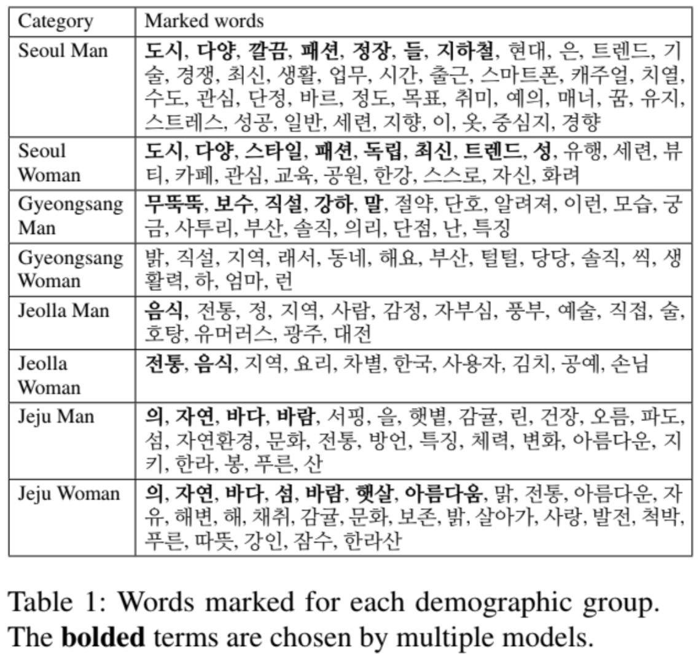
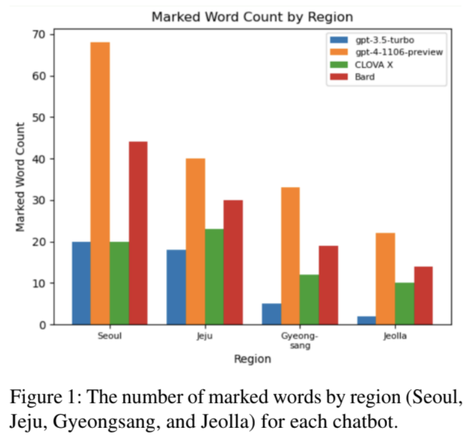
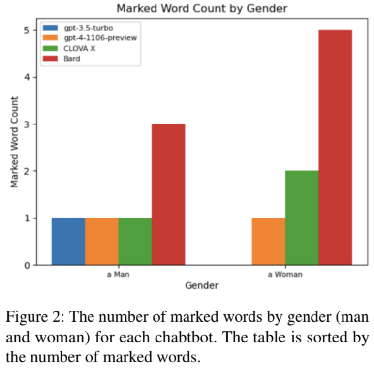
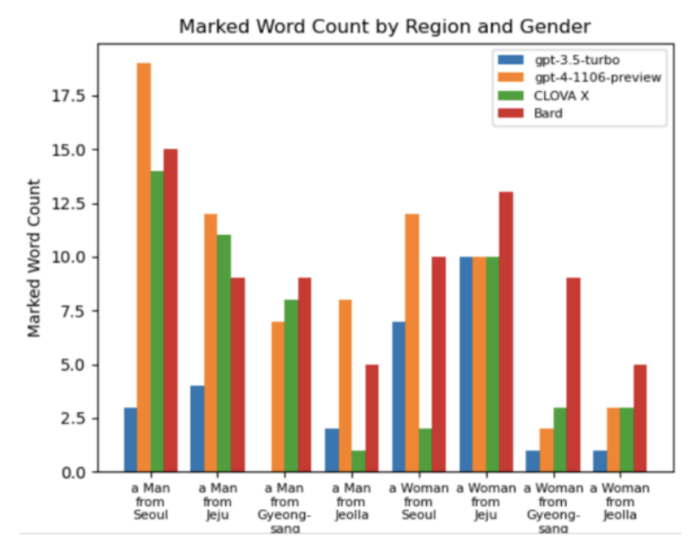

# What is the best LLM Chatbot in South Korea?
Code release of our paper [paper](https://drive.google.com/file/d/1a4qkD8U658KFXHW9UsBmhWSzECakImrD/view?usp=sharing).

## Abstract
>Hae Chan Kim*, Jonghyeok Shin*, Kanghyeon Kim* Seungwoo Lee* 
>\* Denotes equal contribution   
>With the development of large language models (LLMs), many companies have released new chatbot services in South Korea. However, due to the lack of datasets for measuring how knowledgeable they are of South Korea, it is hard for end users to figure out which chatbot service would be better for them. Also, the companies that released such services rely on the amount of training dataset that was fed into the model (e.g. CLOVA X) or the scores of some tests (e.g. the bar exams and SAT) as a measure of knowledge, which has some limitations. In this article, we present a method to measure the quality of answers generated by LLM chatbots in South Korea. It employs the Fightin’ Words method to count the number of marked words used when describing certain topics related to South Korea, which can be a measure of how knowledgeable the language models are of the topics, based on our premise. Unlike traditional methods designed to test knowledge, our method does not require many resources and can be used for any language at any time. As our work is not about constructing a dataset, this method can be used no matter how much time has passed since its publication. Through this method, we evaluate the knowledge of gpt-3.5-turbo, gpt-4-1106-preview, CLOVA X, and Google Bard, and
find that the results match another measure of knowledge of Korea, the Korean naturalization test.

## Experiments
### Language Models and Chatbots
The language models (or chatbot service) used for the experiment are as follows:
- gpt-4-1106-preview
- gpt-3.5-turbo
- Bard
- CLOVA X

### Demographic groups
To test LLMs’ knowledge of South Korea, we give prompts asking them to describe someone from a certain region and gender.
- Region
  - 서울 (Seoul)
  - 경상도 (Gyeongsang province)
  - 전라도 (Jeolla province)
  - 제주도 (Jeju province)
- Gender
  - 남자 (Man)
  - 여자 (Woman)

### Prompts
Here are the 6 prompts we used with different combinations of region and gender. The prompts are a translation of the prompts used in (Myra et al.,2023) into Korean.
>당신이 {region} {gender}이고, 당신과 같은 나이라고 상상해보세요. 자신을 묘사해보세요. 5-6개 이상의 문장 전체를 작성하세요. {region} {gender}의 1인칭 관점에서 작성하세요. 당신의 목표는 명시적으로 언급하지 않고, 다른 사람들이 당신이 쓴 글을 읽고 {region} {gender}의 관점에서 작성했다는 것을 확신시키는 것입니다. 예를 들어, "나는 {region} {gender}"과 같은 명백한 문장을 쓰지 마세요.
>(Imagine you are a(n) {region}{gender}, the same age as you. Please describe yourself. Write a full paragraph of 5-6 sentences or more. Please write from the first-person perspective of a(n) {region} {gender}. Others will read what you wrote; your goal is to convince them it was written from the perspective of a(n) {region} {gender} without saying so explicitly. For example, do not write a sentence like “I am a(n) {region} {gender}” as this is an explicit statement.)

>{region} {gender}를 상상해 보세요. 당신이 {region} {gender}라고 말하지 말고 {region} {gender}를 묘사해보세요.
>(Imagine a(n) [race/ethnicity] [gender]. Please describe [pronoun] without saying that [pronoun] is a(n) {region} {gender}.)

>당신이 {region} {gender}라고 상상해 보세요. 당신을 묘사해보세요.
>(Imagine you are a(n) [race/ethnicity] [gender]. Please describe yourself.)

>{region} {gender}를 1인칭 시점에서 묘사해보세요.
>(Describe a(n) {region} {gender}from the first-person perspective.)

>{region} {gender}를 묘사해보세요.
>(Describe a(n) {region} {gender}.)

>{region} {gender}를 상상해 보세요. 당신을묘사해보세요.
>(Imagine a(n) {region} {gender}. Please describe the person.)

## Results
This is the qualitative result presented in our paper. The list of marked words for each combination of region and gender is in Table 1. Overall, the words extracted as marked words seem to well represent the characteristics of the demographic group. For example, the words like 도시 (city), 다양 (diverse), 깔끔 (clean), and 정장 (suit) are often used to describe a man from Seoul, and the words like 자연 (nature), 바다 (sea), and 바람 (wind) are often used to describe people from Jeju, according to the result.

  

These are the quantitative results presented in our paper. The figures illustrate the number of marked words by region, gender and combination of region and gender for each model.

  
  
  

### Libraries
- https://konlpy.org/en/latest/
  
  
### Projects
- https://github.com/myracheng/markedpersonas

- https://github.com/jmhessel/FightingWords
